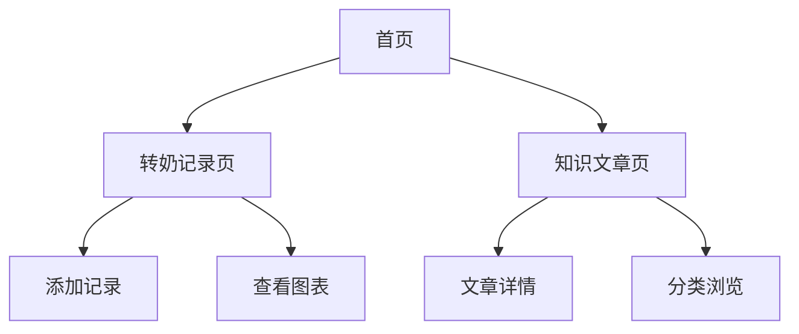

## 1. Product Overview
婴儿转奶助手是一款专为新手父母设计的小程序，帮助记录和管理宝宝转奶过程，提供科学的奶粉知识指导。
- 解决父母在婴儿转奶过程中的记录混乱、信息获取困难等问题
- 目标用户：0-12个月婴儿的父母群体
- 市场价值：打造专业、易用的婴儿喂养管理工具

## 2. Core Features

### 2.1 User Roles
| Role | Registration Method | Core Permissions |
|------|---------------------|------------------|
| 普通用户 | 微信授权登录 | 查看知识文章、记录转奶数据 |

### 2.2 Feature Module
婴儿转奶助手小程序包含以下核心页面：
1. **首页**：转奶记录入口、知识文章推荐、快速记录按钮
2. **转奶记录页**：记录列表、图表展示、模式切换
3. **知识文章页**：文章列表、文章详情、分类浏览

### 2.3 Page Details
| Page Name | Module Name | Feature description |
|-----------|-------------|---------------------|
| 首页 | 快捷记录区 | 点击添加新的转奶记录，包含时间、奶粉品牌、喂养量等基本信息 |
| 首页 | 记录统计卡片 | 显示本周转奶次数、当前使用奶粉品牌等统计数据 |
| 首页 | 推荐文章区 | 展示最新或热门的奶粉相关知识文章，点击跳转详情 |
| 转奶记录页 | 记录列表 | 按时间倒序展示所有转奶记录，支持编辑和删除操作 |
| 转奶记录页 | 图表模式 | 可视化展示转奶趋势，包括喂养量变化、品牌切换时间轴 |
| 转奶记录页 | 模式切换 | 一键切换列表视图和图表视图，保存用户偏好设置 |
| 知识文章页 | 文章分类 | 按奶粉品牌、年龄段、转奶阶段等维度分类展示文章 |
| 知识文章页 | 文章详情 | 展示文章标题、作者、发布时间、正文内容，支持收藏和分享 |

## 3. Core Process
用户首次使用小程序时，通过微信授权登录进入首页。在首页可以快速添加转奶记录，查看统计信息和学习相关知识。进入转奶记录页面后，可以在列表模式和图表模式之间切换，查看历史记录趋势。在知识文章页面，用户可以浏览不同分类的奶粉相关知识，获取科学的喂养指导。

## 4. User Interface Design

### 4.1 Design Style
- 主色调：温暖橙色 (#FF6B35) 代表关爱和温暖
- 辅助色：柔和蓝色 (#4ECDC4) 代表专业和信任
- 按钮样式：圆角矩形，带有轻微阴影效果
- 字体：优先使用系统默认字体，标题16-18px，正文14px
- 布局风格：卡片式布局，清晰的信息层级
- 图标风格：圆润简洁的线性图标，符合亲子主题

### 4.2 Page Design Overview
| Page Name | Module Name | UI Elements |
|-----------|-------------|-------------|
| 首页 | 快捷记录区 | 橙色圆形按钮位于右下角，点击弹出模态框；使用温馨的婴儿相关插画作为背景 |
| 首页 | 记录统计卡片 | 采用渐变色卡片设计，显示关键数据；使用大字体突出数字，小字体说明文字 |
| 转奶记录页 | 记录列表 | 时间轴式设计，左侧显示时间，右侧显示记录详情；支持左滑删除操作 |
| 转奶记录页 | 图表模式 | 使用折线图展示喂养量变化，不同颜色代表不同奶粉品牌；支持手势缩放 |
| 知识文章页 | 文章列表 | 图文卡片布局，标题使用深灰色，摘要使用浅灰色；显示阅读时长和收藏状态 |

### 4.3 Responsiveness
采用移动优先设计策略，适配各种手机屏幕尺寸。考虑到小程序主要在移动设备上使用，重点优化触摸交互体验，按钮尺寸不小于44px，确保易于点击操作。