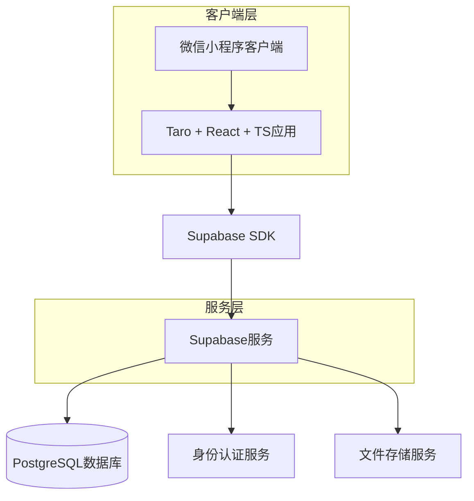
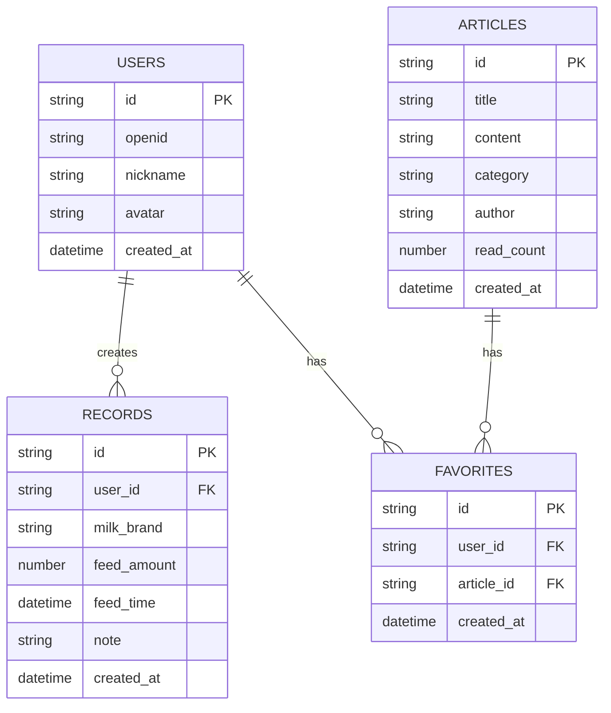

## 1. Architecture design



## 2. Technology Description
- 前端框架：Taro@3 + React@18 + TypeScript
- 初始化工具：Taro CLI
- 后端服务：Supabase (BaaS)
- 数据库：PostgreSQL (由Supabase提供)
- 状态管理：React Hooks + Context API
- 图表库：ECharts for Taro
- UI组件库：Taro UI

## 3. Route definitions
| Route | Purpose |
|-------|---------|
| /pages/index/index | 首页，展示快捷记录和统计信息 |
| /pages/records/index | 转奶记录页，列表和图表模式 |
| /pages/articles/index | 知识文章列表页 |
| /pages/articles/detail | 文章详情页 |
| /pages/profile/index | 用户个人中心 |

## 4. API definitions

### 4.1 转奶记录相关API

```
GET /api/records
```

Request:
| Param Name | Param Type | isRequired | Description |
|------------|------------|------------|-------------|
| user_id | string | true | 用户ID |
| start_date | string | false | 开始日期 |
| end_date | string | false | 结束日期 |

Response:
```json
{
  "records": [
    {
      "id": "uuid",
      "user_id": "string",
      "milk_brand": "string",
      "feed_amount": "number",
      "feed_time": "datetime",
      "note": "string"
    }
  ]
}
```

```
POST /api/records
```

Request:
| Param Name | Param Type | isRequired | Description |
|------------|------------|------------|-------------|
| milk_brand | string | true | 奶粉品牌 |
| feed_amount | number | true | 喂养量(ml) |
| feed_time | datetime | true | 喂养时间 |
| note | string | false | 备注信息 |

### 4.2 文章相关API

```
GET /api/articles
```

Request:
| Param Name | Param Type | isRequired | Description |
|------------|------------|------------|-------------|
| category | string | false | 文章分类 |
| page | number | false | 页码 |
| limit | number | false | 每页数量 |

## 5. Data model

### 5.1 Data model definition



### 5.2 Data Definition Language

用户表 (users)
```sql
CREATE TABLE users (
  id UUID PRIMARY KEY DEFAULT gen_random_uuid(),
  openid VARCHAR(255) UNIQUE NOT NULL,
  nickname VARCHAR(100),
  avatar VARCHAR(500),
  created_at TIMESTAMP WITH TIME ZONE DEFAULT NOW()
);

-- 创建索引
CREATE INDEX idx_users_openid ON users(openid);
```

转奶记录表 (records)
```sql
CREATE TABLE records (
  id UUID PRIMARY KEY DEFAULT gen_random_uuid(),
  user_id UUID NOT NULL,
  milk_brand VARCHAR(100) NOT NULL,
  feed_amount INTEGER NOT NULL CHECK (feed_amount > 0),
  feed_time TIMESTAMP WITH TIME ZONE NOT NULL,
  note TEXT,
  created_at TIMESTAMP WITH TIME ZONE DEFAULT NOW(),
  FOREIGN KEY (user_id) REFERENCES users(id)
);

-- 创建索引
CREATE INDEX idx_records_user_id ON records(user_id);
CREATE INDEX idx_records_feed_time ON records(feed_time DESC);
```

文章表 (articles)
```sql
CREATE TABLE articles (
  id UUID PRIMARY KEY DEFAULT gen_random_uuid(),
  title VARCHAR(200) NOT NULL,
  content TEXT NOT NULL,
  category VARCHAR(50) NOT NULL,
  author VARCHAR(100),
  read_count INTEGER DEFAULT 0,
  created_at TIMESTAMP WITH TIME ZONE DEFAULT NOW()
);

-- 创建索引
CREATE INDEX idx_articles_category ON articles(category);
CREATE INDEX idx_articles_created_at ON articles(created_at DESC);
```

收藏表 (favorites)
```sql
CREATE TABLE favorites (
  id UUID PRIMARY KEY DEFAULT gen_random_uuid(),
  user_id UUID NOT NULL,
  article_id UUID NOT NULL,
  created_at TIMESTAMP WITH TIME ZONE DEFAULT NOW(),
  FOREIGN KEY (user_id) REFERENCES users(id),
  FOREIGN KEY (article_id) REFERENCES articles(id),
  UNIQUE(user_id, article_id)
);

-- 创建索引
CREATE INDEX idx_favorites_user_id ON favorites(user_id);
```

### 5.3 Supabase权限设置

```sql
-- 基本权限设置
GRANT SELECT ON users TO anon;
GRANT ALL PRIVILEGES ON users TO authenticated;

GRANT SELECT ON records TO anon;
GRANT ALL PRIVILEGES ON records TO authenticated;

GRANT SELECT ON articles TO anon;
GRANT ALL PRIVILEGES ON articles TO authenticated;

GRANT SELECT ON favorites TO anon;
GRANT ALL PRIVILEGES ON favorites TO authenticated;

-- RLS策略示例
ALTER TABLE records ENABLE ROW LEVEL SECURITY;

CREATE POLICY "用户只能查看自己的记录" ON records
  FOR SELECT USING (auth.uid() = user_id);

CREATE POLICY "用户只能创建自己的记录" ON records
  FOR INSERT WITH CHECK (auth.uid() = user_id);
```